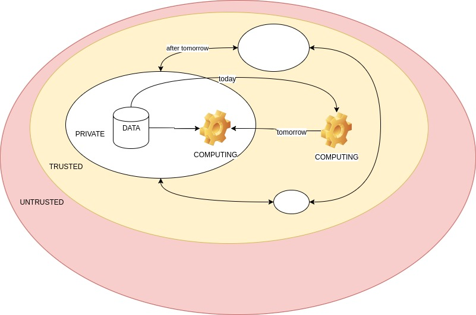

#Privacy preserving IoT: on the value of data 

## Concept

We do believe there is a big value in IoT data, in particular when such data are related to personal information (e.g on health or user behaviors). Such value is often "hidden" and becomes clear only after some information retrival and/or data mining algorithm and/or machine learning algorithm runs on it. 

Nowadays, the extraction of useful insights from personal data is demanded to trusted third parties (see picture below). To do that, our data has to leave our private domain, and consequently we loose their control. 

We hope for a future, in which the data will always be under the control of their owner, that will be able to valorize them in the most convenient way.

To support our vision, some technologies have to be developed and/or integrated and employed. 

1. A technology to track data and their usage
2. A technology to quantify the quality/value of the data
3. A technology to valorize data 
4. A technology to extract information from data in a privacy preserving way 

Notice that, if we will be able to develop point 4 (see below for a preliminary SOTA) this will also help in point 2, at least in some contexts. As an example, let's assume to have a technology to build privacy preserving prediction models and let's assume that a user U participated to the creation of a model M with its data D. The accuracy of predictions based on M, on D and on new data, could be potentially used as a proxy to establish the value of D itself. As much is the prediction accuracy of M, as much is the quality of D and thus their potential value. 

Finally observe that blockchain, seems to be an effective solution to handle at least some aspects of point 1 and 3. 

 

## SOTA on technologies to extract information from data in a privacy preserving way 

Inspiring paper by Vitaly Shmatikov on [Privacy-Preserving Deep Learning](http://ieeexplore.ieee.org/document/7447103/)  

[Efficient Algorithms for Public-Private Social Networks](http://dl.acm.org/citation.cfm?id=2783354) Efficient Algorithms for Public-Private Social Networks

[Privacy Preserving Clustering](http://www.patrickmcdaniel.org/pubs/esorics05.pdf)  

## Deep Learning in Python

Run [Keras on Jupyter over Docker](http://ermaker.github.io/blog/2015/09/09/keras-and-jupyter-with-docker.html) Keras on Jupyter over Docker

``docker run -d -p 8888:8888 -v '/home/andrea/Documents/papers/IoTBC/Deep Learning/notebook':/notebook -e KERAS_BACKEND=tensorflow ermaker/keras-jupyter``
	
``docker run -v '/home/andrea/Documents/papers/IoTBC/Deep Learning/notebook':/notebook --rm -it ermaker/keras``

## Distribute Private Keys to the nodes

Inside PythonScript folder, the available script distributes a private (signing) key to a receiving node. Then, it parses each line of data tryin to verify the signature.
Inside node folder, there is the project for the node. It works as follows:

1- Wait to receive a private (signing) key from the serial line

2- Increment a counter each second and send a message with the following format:
	(message, digest, signature)